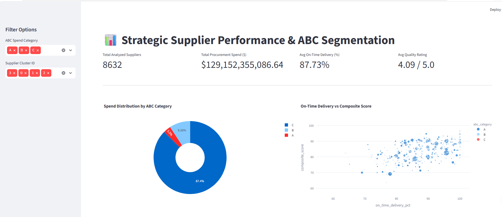
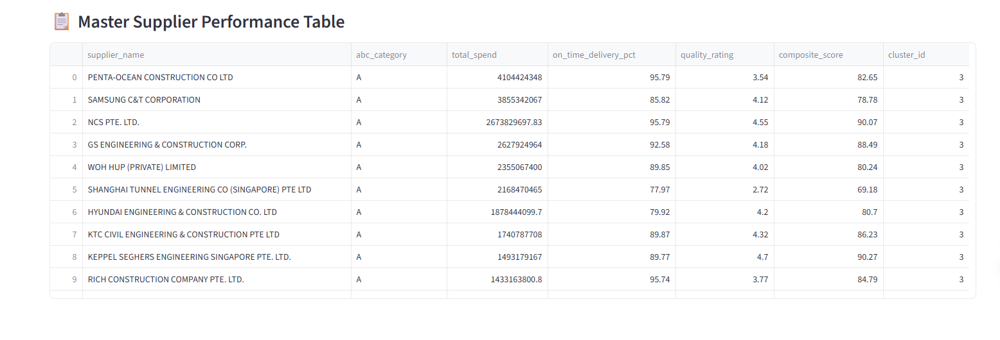

# 📊 Procurement Spend Analytics & Supplier Performance Dashboard

 🔗 **[🚀 Click Here to Launch Live Interactive Dashboard](https://supplier-procurement-analytics-yqde9najspiglstrhdh36g.streamlit.app/)**

An end-to-end data analytics and business intelligence solution designed to segment suppliers, assess vendor performance, and optimize multi-billion-dollar procurement operations using **ABC Spend Analysis**, **Multi-Criteria Scoring**, and **Unsupervised K-Means Machine Learning**.

---

 Executive Dashboard Preview

| **Interactive Overview & KPI Summary** | **Master Performance & Segmentation Matrix** |
| :---: | :---: |
|  |  |

---

 Business Problem & Purpose

Enterprise procurement departments often manage thousands of vendor relationships with billions of dollars in active spend. Without structured data pipelines and analytics:
1. **Capital Risk:** High-spend suppliers remain unmonitored for delivery and quality performance.
2. **Resource Allocation:** Procurement teams waste time negotiating low-impact purchases instead of strategic accounts.
3. **Vendor Evaluation:** Evaluation is often subjective rather than data-driven.

This project processes **$129.15 Billion** across **8,632 suppliers** to deliver actionable insights and automated risk profiling.

---

 Step-by-Step Implementation Procedure

### **Step 1: Data Synthesis & Master Consolidation**
* **Script:** `generate_master_data.py`
* Aggregated raw purchasing transactions from `government-procurement-via-gebiz.csv`.
* Consolidated vendor transaction frequency, total expenditure, and generated performance metrics (On-Time Delivery %, Quality Rating out of 5, and Cost Competitiveness Score).

### **Step 2: ABC Spend Categorization (Pareto Principle)**
* **Script:** `abc_analysis.py`
* Ranked suppliers by total spend in descending order and calculated cumulative spend percentage.
* Categorized suppliers based on the classic 80/20 rule:
  * **Class A:** Top 80% of cumulative spend (High financial impact).
  * **Class B:** Next 15% of spend (Moderate financial impact).
  * **Class C:** Final 5% of spend (Low financial impact / tail spend).

### **Step 3: Multi-Criteria Composite Scoring & K-Means Clustering**
* **Script:** `kmeans_clustering.py`
* Computed a weighted **Composite Performance Score (0–100 scale)**:
  $$\text{Composite Score} = (0.40 \times \text{Delivery\%}) + (0.40 \times \text{Quality Rating Score}) + (0.20 \times \text{Cost Score})$$
* Normalized key feature vectors (`StandardScaler`) and applied **K-Means Clustering ($k=4$)** to group suppliers into distinct risk and capability clusters.

### **Step 4: Interactive Executive Dashboard**
* **Script:** `app.py`
* Built a web application using **Streamlit** and **Plotly** to provide real-time filtering by ABC classification and Cluster ID, key KPI metric cards, interactive distribution charts, and a full master data table.

---

## 🧪 Analytical Methodologies & What They Mean

### **1. ABC Analysis (Spend Segmentation)**
* **Methodology:** Application of Pareto’s 80/20 rule to categorize inventory/vendors based on total spend.
* **What it Means:** Allows procurement leaders to prioritize negotiation time and strategic relationship management on Class A vendors, while streamlining or automating procurement for Class C tail spend.

### **2. Multi-Criteria Composite Performance Scoring**
* **Methodology:** Balanced scorecard weighting across core operational KPIs ($40\%$ Delivery, $40\%$ Quality, $20\%$ Cost).
* **What it Means:** Prevents selecting vendors purely on low cost. A supplier offering cheap pricing but having poor delivery reliability ($<70\%$) receives a low overall score, shielding the supply chain from bottleneck risks.

### **3. K-Means Machine Learning Clustering ($k=4$)**
* **Methodology:** Unsupervised clustering algorithm grouping data points based on Euclidean distance across standardized features (`total_spend`, `on_time_delivery_pct`, `quality_rating`, `cost_competitiveness_score`, `composite_score`).
* **What it Means:** Automatically identifies distinct operational supplier profiles without manual bias:
  * **Cluster 0 — Core Reliable Partners:** High delivery, solid quality, moderate spend.
  * **Cluster 1 — High-Risk Bottlenecks:** Moderate/high spend but low delivery/quality scores.
  * **Cluster 2 — Tail-Spend Vendors:** Low spend, variable performance.
  * **Cluster 3 — Strategic Heavyweights (Class A):** Multi-billion dollar spend requiring executive oversight.

---

## 📈 Key Findings & Insights

* **Total Analyzed Scope:** **$129.15 Billion** across **8,632 unique suppliers**.
* **Spend Concentration:** **87.4%** of total procurement capital is held by **Class A** vendors (285 vendors), confirming a concentrated vendor dependence.
* **Network Performance Averages:** Average On-Time Delivery across the network stands at **87.73%**, with an average quality score of **4.09 / 5.0**.

---

## 💻 Tech Stack & Dependencies

* **Language:** Python 3.13
* **Data Manipulation:** `pandas`, `numpy`
* **Machine Learning & Analytics:** `scikit-learn` (`StandardScaler`, `KMeans`)
* **Data Visualization & Web App:** `streamlit`, `plotly`
* **Version Control & Hosting:** Git, GitHub, Streamlit Community Cloud
